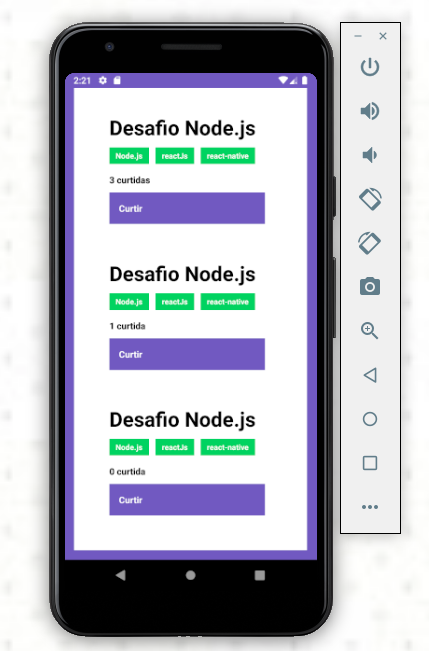

# Conceito-React-Native

## O que é

Desafio sobre conceitos do React-Native, para praticar os conhecimentos.

## Funções 

Lista os repositórios utilizando o [backend](https://github.com/JonathanKBP/conceitos-nodejs), e permite dar like neles.

## imagem

